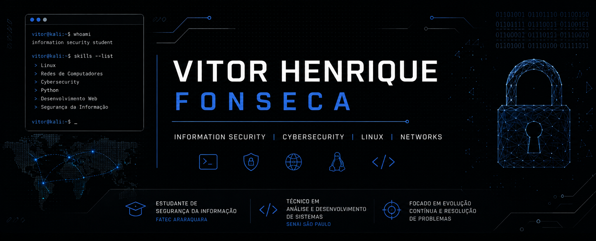

<div align="center">
  
</div>

<br>

<h1 align="center">Olá, eu sou o Vitor 👋</h1>

<p align="center">
  <strong>Estudante de Segurança da Informação | Técnico em Análise e Desenvolvimento de Sistemas</strong>
</p>

<p align="center">
  <a href="https://www.linkedin.com/in/vitorhfonseca/">
    
  </a>
  <a href="mailto:vitorfonsecaxs@gmail.com">
    
  </a>
</p>

---

## 🧑‍💻 Sobre mim

🎓 Estudante de **Segurança da Informação na FATEC**

💻 Técnico em **Análise e Desenvolvimento de Sistemas pelo SENAI**

🔐 Atualmente direcionando meus estudos para **Cybersecurity**, com interesse em segurança ofensiva, Pentest, Linux e redes.

Minha base em desenvolvimento de software me permite compreender aplicações, APIs, bancos de dados e diferentes tecnologias utilizadas no desenvolvimento de sistemas. Atualmente, busco aplicar essa base no estudo de segurança da informação e desenvolver projetos práticos na área.

Estou constantemente buscando novos conhecimentos e oportunidades para evoluir profissionalmente em **Tecnologia e Cybersecurity**.

---

## 🔐 Cybersecurity

Atualmente estou estudando e desenvolvendo conhecimentos em:

* 🐧 Linux e Kali Linux
* 🌐 Redes de computadores e TCP/IP
* 🔎 Fundamentos de segurança da informação
* 🛡️ Segurança de aplicações web
* 🎯 Segurança ofensiva e Pentest
* 🔐 Autenticação e segurança de aplicações
* 🧪 Laboratórios e ambientes de estudo controlados

> Meu objetivo é transformar conhecimento teórico em prática por meio de laboratórios, projetos e desafios de segurança.

---

## 💻 Tecnologias

### Linguagens

<p>
  
  
  
</p>

### Desenvolvimento Web

<p>
  
  
  
  
</p>

### Banco de Dados

<p>
  
</p>

### Sistemas e Ferramentas

<p>
  
  
  
  
</p>

---

## 🚀 Projetos

Alguns dos projetos que desenvolvi durante minha formação em tecnologia:

### 🌐 Desenvolvimento Web

* **Aplicações Web com Flask e MySQL**

  * Backend desenvolvido em Python utilizando Flask
  * Integração com banco de dados MySQL
  * Sistema de autenticação e gerenciamento de usuários

* **Aplicações com React**

  * Desenvolvimento de interfaces utilizando React e JavaScript
  * Componentização e interação com APIs

* **Projetos Web**

  * HTML, CSS, JavaScript, Bootstrap e Tailwind CSS

### 🤖 IoT

* Projetos utilizando **ESP32/Arduino**
* Integração entre dispositivos e aplicações web
* Comunicação com backend desenvolvido em Flask

### 🔐 Cybersecurity

Atualmente estou construindo projetos e laboratórios voltados para:

* Segurança de aplicações web
* Linux e redes
* Vulnerabilidades e exploração em ambientes controlados
* Fundamentos de Pentest
* CTFs e laboratórios de segurança

> Novos projetos de Cybersecurity serão adicionados conforme avanço nos meus estudos.

---

## 🎓 Formação

**FATEC Araraquara — Segurança da Informação**
2026 — 2029

**SENAI "Henrique Lupo" — Técnico em Análise e Desenvolvimento de Sistemas**
Concluído

---

## 📚 Atualmente estudando

```text
Cybersecurity
├── Linux
├── Redes
├── Segurança Web
├── HTTP / APIs
├── OWASP
├── Segurança Ofensiva
└── Pentest
```

---

## 📫 Contato

<p>
  <a href="mailto:vitorfonsecaxs@gmail.com">
    
  </a>
  <a href="https://www.linkedin.com/in/vitorhfonseca/">
    
  </a>
</p>

---

<p align="center">
  <i>"Discipline creates consistency. Consistency creates results."</i>
</p>
